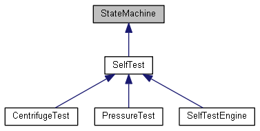
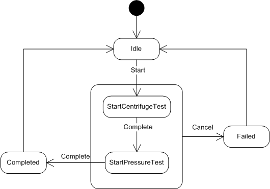
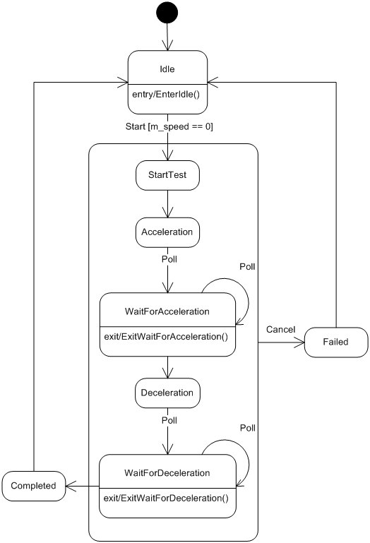
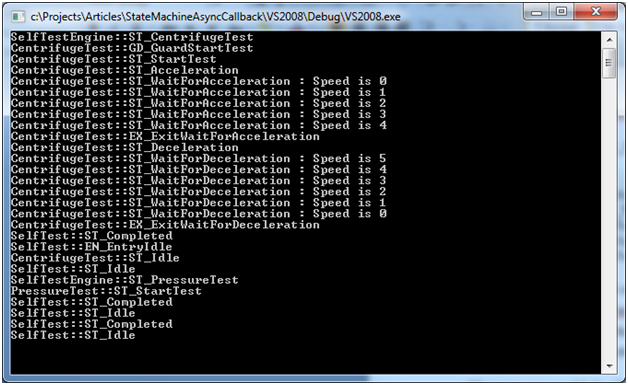

# C++ State Machine with Threads

A framework combining C++ state machines and multicast asynchronous callbacks.

# Table of Contents

- [C++ State Machine with Threads](#c-state-machine-with-threads)
- [Table of Contents](#table-of-contents)
- [Preface](#preface)
  - [Related Repositories](#related-repositories)
- [Introduction](#introduction)
- [Self-Test Subsystem](#self-test-subsystem)
- [Asynchronous Callbacks](#asynchronous-callbacks)
  - [SelfTestEngine](#selftestengine)
  - [CentrifugeTest](#centrifugetest)
  - [Timer](#timer)
- [Poll Events](#poll-events)
- [Connecting Callbacks to Event Functions](#connecting-callbacks-to-event-functions)
- [User Interface](#user-interface)
- [Run-Time](#run-time)
- [References](#references)
- [Conclusion](#conclusion)

# Preface

Originally published on CodeProject at: <a href="https://www.codeproject.com/Articles/1156423/Cplusplus-State-Machine-with-Threads"><strong>C++ State Machine with Threads</strong></a>

<a href="https://www.cmake.org/">CMake</a>&nbsp;is used to create the build files. CMake is free and open-source software. Windows, Linux and other toolchains are supported. See the <strong>CMakeLists.txt </strong>file for more information.

## Related Repositories

<ul>
    <li><a href="https://github.com/endurodave/StateMachineWithModernDelegates">C++ State Machine with Modern Asynchronous Multicast Delegates</a> - by David Lafreniere</li>
	<li><a href="https://github.com/endurodave/StateMachineWithDelegates">C++ State Machine with Asynchronous Multicast Delegates</a> - by David Lafreniere</li>
</ul>

# Introduction

A software-based Finite State Machines (FSM) is an implementation method used to decompose a design into states and events. Simple embedded devices with no operating system employ single threading such that the state machines run on a single &ldquo;thread&rdquo;. More complex systems use multithreading to divvy up the processing.

Many FSM implementations exist including one I wrote about here on Code Project entitled &ldquo;<strong><a href="http://www.codeproject.com/Articles/1087619/State-Machine-Design-in-Cplusplus">State Machine Design in C++</a></strong>&rdquo;. The article covers how to create C++ state machines using the <code>StateMachine</code> base class. What is missing, however, is how to integrate multiple state machines into the context of a multithreaded environment.

&ldquo;<strong><a href="http://www.codeproject.com/Articles/1092727/Asynchronous-Multicast-Callbacks-with-Inter-Thread">Asynchronous Multicast Callbacks with Inter-Thread Messaging</a></strong>&rdquo; is another article I wrote on Code Project. This design provides a simple, portable callback mechanism that handles the low-level details of asynchronously invoking a callback with event data on a client-specified thread of control.

This article combines the two previously described techniques, state machines and asynchronous callbacks, into a single project. In the previous articles, it may not be readily apparent using simple examples how multiple state machines coordinate activities and dispatch events to each other. The goal for the article is to provide a complete working project with threads, timers, events, and state machines all working together. To illustrate the concept, the example project implements a state-based self-test engine utilizing asynchronous communication between threads.

I won&rsquo;t be re-explaining the <code>StateMachine </code>and <code>AsyncCallback&lt;&gt;</code> implementations as the prior articles do that already. The primary focus is on how to combine the state machine and asynchronous callbacks into a single framework.

Visual Studio 2008 and 2015 projects are included for easy experimentation. While the Windows operating system provides threads, locks, message queues, and timers, the code is partitioned for easy porting to other embedded or PC-based systems.

# Self-Test Subsystem

Self-tests execute a series of tests on hardware and mechanical systems to ensure correct operation. In this example, there are four state machine classes implementing our self-test subsystem as shown in the inheritance diagram below:

<strong>Figure 1: Self-Test Subsystem Inheritance Diagram</strong>

# Asynchronous Callbacks

The <code>AsyncCallback&lt;&gt;</code> class is used throughout to provide asynchronous callbacks. The first place it&#39;s used is within the <code>SelfTest</code> class. Whenever a self-test completes a <code>SelfTest::CompletedCallback</code> callback is invoked notifying&nbsp;registered clients. <code>SelfTestEngine </code>registers with both&nbsp;<code>CentrifugeTest </code>and <code>PressureTest </code>to get informed when the test is complete.

The second location is the user interface registers&nbsp;with <code>SelfTestEngine::StatusCallback</code>. This allows a client, running on another thread, to register and receive status callbacks during execution. <code>AsyncCallback&lt;&gt;</code> allows the client to specify the exact callback thread making is easy to avoid cross-threading errors.

The final location is within the <code>Timer</code> class which fires periodic callbacks on a registered callback function. A generic, low-speed timer capable of calling a function on the client-specified thread is quite useful for event driven state machines where you might want to poll for some condition to occur. In this case, the <code>Timer</code> class is used to inject poll events into the state machine instances.

## SelfTestEngine

<code>SelfTestEngine</code> is thread-safe and the main point of contact for client&rsquo;s utilizing the self-test subsystem. <code>CentrifugeTest</code> and <code>PressureTest</code> are members of <code>SelfTestEngine</code>. <code>SelfTestEngine</code> is responsible for sequencing the individual self-tests in the correct order as shown in the state diagram below. &nbsp;

<strong>Figure 2: SelfTestEngine State Machine</strong>

The <code>Start</code> event initiates the self-test engine.&nbsp;<code>&nbsp;SelfTestEngine::Start()</code> is an asynchronous function relying upon <code>StartCallback</code> to invoke the private <code>SelfTestEngine::StartPrivateCallback()</code> event function. Since <code>Start()</code> is asynchronous, &nbsp;it is thread-safe to be called by any client running on any thread.&nbsp;

<pre lang="c++">
void SelfTestEngine::Start()
{
&nbsp;&nbsp; &nbsp;// Asynchronously call StartPrivateCallback
&nbsp;&nbsp; &nbsp;StartCallback(NoData());
}

void SelfTestEngine::StartPrivateCallback()
{
&nbsp;&nbsp; &nbsp;BEGIN_TRANSITION_MAP&nbsp;&nbsp; &nbsp;&nbsp;&nbsp; &nbsp;&nbsp;&nbsp; &nbsp; &nbsp; &nbsp; &nbsp; &nbsp; &nbsp; &nbsp; &nbsp;&nbsp;&nbsp; &nbsp;&nbsp;&nbsp; &nbsp; &nbsp;// - Current State -
&nbsp;&nbsp; &nbsp;&nbsp;&nbsp; &nbsp;TRANSITION_MAP_ENTRY (ST_START_CENTRIFUGE_TEST)&nbsp;&nbsp;  &nbsp;// ST_IDLE
&nbsp;&nbsp; &nbsp;&nbsp;&nbsp; &nbsp;TRANSITION_MAP_ENTRY (CANNOT_HAPPEN)&nbsp;&nbsp; &nbsp;&nbsp;&nbsp; &nbsp;&nbsp;&nbsp; &nbsp;&nbsp;&nbsp; &nbsp;// ST_COMPLETED
&nbsp;&nbsp; &nbsp;&nbsp;&nbsp; &nbsp;TRANSITION_MAP_ENTRY (CANNOT_HAPPEN)&nbsp;&nbsp; &nbsp;&nbsp;&nbsp; &nbsp;&nbsp;&nbsp; &nbsp;&nbsp;&nbsp; &nbsp;// ST_FAILED
&nbsp;&nbsp; &nbsp;&nbsp;&nbsp; &nbsp;TRANSITION_MAP_ENTRY (EVENT_IGNORED)&nbsp;&nbsp; &nbsp;&nbsp;&nbsp; &nbsp;&nbsp;&nbsp; &nbsp;&nbsp;&nbsp; &nbsp;// ST_START_CENTRIFUGE_TEST
&nbsp;&nbsp; &nbsp;&nbsp;&nbsp; &nbsp;TRANSITION_MAP_ENTRY (EVENT_IGNORED)&nbsp;&nbsp; &nbsp;&nbsp;&nbsp; &nbsp;&nbsp;&nbsp; &nbsp;&nbsp;&nbsp; &nbsp;// ST_START_PRESSURE_TEST
&nbsp;&nbsp; &nbsp;END_TRANSITION_MAP(NULL)
}</pre>

When each self-test completes, the <code>Complete</code> event fires causing the next self-test to start. After all of the tests are done, the state machine transitions to <code>Completed</code>&nbsp;and back to <code>Idle</code>. If the <code>Cancel</code> event is generated at any time during execution, a transition to the <code>Failed </code>state occurs.

The <code>SelfTest</code> base class provides three states common to all <code>SelfTest</code>-derived state machines: <code>Idle</code>, <code>Completed</code>, and <code>Failed</code>. <code>SelfTestEngine</code> then adds two more states: <code>StartCentrifugeTest</code> and <code>StartPressureTest</code>.

<code>SelfTestEngine</code> has one public event function, <code>Start()</code>, that starts the self-tests. <code>SelfTestEngine::StatusCallback</code> is an asynchronous callback allowing client&rsquo;s to register for status updates during testing. A <code>WorkerThread</code> instance is also contained within the class. All self-test state machine execution occurs on this thread.

<pre lang="c++">
class SelfTestEngine : public SelfTest
{
public:
    // Clients register for asynchronous self-test status callbacks
    static AsyncCallback&lt;SelfTestStatus&gt; StatusCallback;

    // Singleton instance of SelfTestEngine
    static SelfTestEngine&amp; GetInstance();

    // Start the self-tests 
    void Start();

    WorkerThread&amp; GetThread() { return m_thread; }
    static void InvokeStatusCallback(std::string msg);

private:
    AsyncCallback&lt;&gt; StartCallback;
    void StartPrivateCallback();

    SelfTestEngine();
    void Complete();

    // Sub self-test state machines 
    CentrifugeTest m_centrifugeTest;
    PressureTest m_pressureTest;

    // Worker thread used by all self-tests
    WorkerThread m_thread;

    // State enumeration order must match the order of state method entries
    // in the state map.
    enum States
    {
        ST_START_CENTRIFUGE_TEST = SelfTest::ST_MAX_STATES,
        ST_START_PRESSURE_TEST,
        ST_MAX_STATES
    };

    // Define the state machine state functions with event data type
    STATE_DECLARE(SelfTestEngine,     StartCentrifugeTest,      NoEventData)
    STATE_DECLARE(SelfTestEngine,     StartPressureTest,        NoEventData)

    // State map to define state object order. Each state map entry defines a
    // state object.
    BEGIN_STATE_MAP
        STATE_MAP_ENTRY(&amp;Idle)
        STATE_MAP_ENTRY(&amp;Completed)
        STATE_MAP_ENTRY(&amp;Failed)
        STATE_MAP_ENTRY(&amp;StartCentrifugeTest)
        STATE_MAP_ENTRY(&amp;StartPressureTest)
    END_STATE_MAP    

    // Declare state machine events that receive async callbacks
    CALLBACK_DECLARE_NO_DATA(SelfTestEngine,    StartPrivateCallback)
    CALLBACK_DECLARE_NO_DATA(SelfTestEngine,    Complete)
    CALLBACK_DECLARE_NO_DATA(SelfTest,          Cancel)
};</pre>

As mentioned previously, the <code>SelfTestEngine</code> registers for asynchronous callbacks from each sub self-tests (i.e. <code>CentrifugeTest</code> and <code>PressureTest</code>) as shown below. When a sub self-test state machine completes, the <code>SelfTestEngine::Complete()</code> function is called. When a sub self-test state machine fails, the <code>SelfTestEngine::Cancel()</code> function is called.

<pre lang="c++">
SelfTestEngine::SelfTestEngine() :
    SelfTest(ST_MAX_STATES),
    m_thread(&quot;SelfTestEngine&quot;)
{
    StartCallback.Register(&amp;SelfTestEngine::StartPrivateCallback, &amp;m_thread, this);

    // Register for callbacks when sub self-test state machines complete or fail
    m_centrifugeTest.CompletedCallback.Register(&amp;SelfTestEngine::Complete, &amp;m_thread, this);
    m_centrifugeTest.FailedCallback.Register(&amp;SelfTestEngine::Cancel, &amp;m_thread, this);
    m_pressureTest.CompletedCallback.Register(&amp;SelfTestEngine::Complete, &amp;m_thread, this);
    m_pressureTest.FailedCallback.Register(&amp;SelfTestEngine::Cancel, &amp;m_thread, this);
}</pre>

The <code>SelfTest</code>&nbsp;base class generates the <code>CompletedCallback</code> and <code>FailedCallback</code> within the <code>Completed</code> and <code>Failed</code> states respectively as seen below:

<pre lang="c++">
STATE_DEFINE(SelfTest, Completed, NoEventData)
{
    SelfTestEngine::InvokeStatusCallback(&quot;SelfTest::ST_Completed&quot;);

    // Generate asychronous completed callback if client is registered
    if (CompletedCallback)
        CompletedCallback(NoData());

    InternalEvent(ST_IDLE);
}

STATE_DEFINE(SelfTest, Failed, NoEventData)
{
    SelfTestEngine::InvokeStatusCallback(&quot;SelfTest::ST_Failed&quot;);

&nbsp;   // Generate asychronous failed callback if client registered
    if (FailedCallback)
        FailedCallback(NoData());

    InternalEvent(ST_IDLE);
}</pre>

One might ask why the state machines use asynchronous callbacks. If the state machines are on the same thread, why not use a normal, synchronous callback instead? The problem to prevent is a callback into a currently executing state machine, that is, the call stack wrapping back around into the same class instance. For example, the following call sequence should be prevented: <code>SelfTestEngine</code> calls <code>CentrifugeTest</code> calls back <code>SelfTestEngine</code>. An asynchronous callback allows the stack to unwind and prevents this unwanted behavior.

## CentrifugeTest

The <code>CentrifugeTest</code> state machine diagram show below implements the centrifuge self-test described in &quot;<a href="https://www.codeproject.com/Articles/1087619/State-Machine-Design-in-Cplusplus"><b>State Machine Design in C++</b></a>&quot;. The difference here is that the <code>Timer</code> class is used to provide <code>Poll</code> events via asynchronous callbacks.

<strong>Figure 3: CentrifugeTest State Machine</strong>

## Timer

The <code>Timer</code> class provides a common mechanism to receive function callbacks by registering with <code>Expired</code>. <code>Start()</code> starts the callbacks at a particular interval. <code>Stop()</code> stops the callbacks.

<pre lang="c++">
class Timer 
{
public:
    static const DWORD MS_PER_TICK;

    /// An expired callback client&#39;s register with to get callbacks
    AsyncCallback&lt;&gt; Expired;

    /// Starts a timer for callbacks on the specified timeout interval.
    /// @param[in]    timeout - the timeout in milliseconds.
    void Start(DWORD timeout);

    /// Stops a timer.
&nbsp;   void Stop();

    ...</pre>

All <code>Timer</code> instances are stored in a private static list. The <code>WorkerThread::Process()</code> loop periodically services all the timers within the list by calling <code>Timer::ProcessTimers()</code>. Client&rsquo;s registered with <code>Expired</code> are invoked whenever the timer expires.

<pre lang="c++">
            case WM_USER_TIMER:
                Timer::ProcessTimers();
                break;</pre>

# Poll Events

<code>CentrifugeTest</code> has a <code>Timer</code> instance and registers for callbacks. The callback function, a thread instance and a <code>this</code> pointer is provided to <code>Register()</code> facilitating the asynchronous callback mechanism.

<pre lang="c++">
// Register for timer callbacks
m_pollTimer.Expired.Register(&amp;CentrifugeTest::Poll, &amp;SelfTestEngine::GetInstance().GetThread(), this);</pre>

When the timer is started using <code>Start()</code>, the <code>Poll()</code> event function is&nbsp;periodically called at the interval specified.

<pre lang="c++">
void CentrifugeTest::Poll()
{
    BEGIN_TRANSITION_MAP                                    // - Current State -
        TRANSITION_MAP_ENTRY (EVENT_IGNORED)                // ST_IDLE
        TRANSITION_MAP_ENTRY (EVENT_IGNORED)                // ST_COMPLETED
        TRANSITION_MAP_ENTRY (EVENT_IGNORED)                // ST_FAILED
        TRANSITION_MAP_ENTRY (EVENT_IGNORED)                // ST_START_TEST
        TRANSITION_MAP_ENTRY (ST_WAIT_FOR_ACCELERATION)     // ST_ACCELERATION
        TRANSITION_MAP_ENTRY (ST_WAIT_FOR_ACCELERATION)     // ST_WAIT_FOR_ACCELERATION
        TRANSITION_MAP_ENTRY (ST_WAIT_FOR_DECELERATION)     // ST_DECELERATION
        TRANSITION_MAP_ENTRY (ST_WAIT_FOR_DECELERATION)     // ST_WAIT_FOR_DECELERATION
    END_TRANSITION_MAP(NULL)
}

STATE_DEFINE(CentrifugeTest, Acceleration, NoEventData)
{
    SelfTestEngine::InvokeStatusCallback(&quot;CentrifugeTest::ST_Acceleration&quot;);

    // Start polling while waiting for centrifuge to ramp up to speed
    m_pollTimer.Start(10);
}</pre>

# Connecting Callbacks to Event Functions

The <code>AsyncCallback&lt;&gt;</code> mechanism is able to invoke a static member function or a free function. However, state machine events are implemented using instance member functions. The key to connecting the two is the <code>CALLBACK_DECLARE</code> and <code>CALLBACK_DECLARE_NO_DATA</code> macros.

<strong>CentrifugeTest.h</strong> has this&nbsp;line:

<pre lang="c++">
CALLBACK_DECLARE_NO_DATA(CentrifugeTest, Poll)</pre>

The first macro argument is the class name. The second is the instance event function name. The macro is defined as:

<pre lang="c++">
#define CALLBACK_DECLARE_NO_DATA(stateMachine, eventName) \
    private:\
    static void eventName(const NoData&amp; data, void* userData) { \
        ASSERT_TRUE(userData != NULL); \
        stateMachine* stateMachine##Instance = static_cast&lt;stateMachine*&gt;(userData); \
        stateMachine##Instance-&gt;eventName(); } </pre>

Expanding the <code>CALLBACK_DECLARE_NO_DATA</code>&nbsp;macro above yields:

<pre lang="c++">
private:
    static void Poll(const NoData&amp; data, void* userData) { 
        ASSERT_TRUE(userData != NULL); 
        CentrifugeTest* CentrifugeTestInstance = static_cast&lt;CentrifugeTest*&gt;(userData); 
        CentrifugeTestInstance-&gt;Poll(); }</pre>

There is no magic here. A static member <code>Poll()</code> function is created that accepts the <code>AsyncCallback&lt;&gt;</code> callback. The <code>void* userData</code> comes from 3rd argument of the <code>Register()</code> function and, in this case, is an instance of <code>CentrifugeTest</code>. The <code>void*</code> is typed to <code>CentrifugeTest*</code> so that the instance member <code>Poll()</code> may be called.

In this case, the &ldquo;<code>NO_DATA</code>&rdquo; macro version is used since the&nbsp;<code>Poll()</code>&nbsp;event doesn&rsquo;t accept an argument. To connect a callback to an event function with&nbsp;event data, the <code>CALLBACK_DELCARE</code> macro is used as shown below:

<pre lang="c++">
CALLBACK_DECLARE(MyStateMachine, MyEventFunc, MyEventFuncData)</pre>

Of course you could do all this without the multiline macro, but it cleans up monotonous code that would otherwise be propagated throughout the project.

# User Interface

The project doesn&rsquo;t have a user interface except the text console output. For this example, the &ldquo;user interface&rdquo; just outputs self-test status messages on the user interface thread via the <code>SelfTestEngineStatusCallback()</code> function:

<pre lang="c++">
WorkerThread userInterfaceThread(&quot;UserInterface&quot;);

void SelfTestEngineStatusCallback(const SelfTestStatus&amp; status, void* userData)
{
    // Output status message to the console &quot;user interface&quot;
    cout &lt;&lt; status.message.c_str() &lt;&lt; endl;
}</pre>

Before the self-test starts, the user interface registers with the <code>SelfTestEngine::StatusCallback</code> callback.

<pre lang="c++">
SelfTestEngine::StatusCallback.Register(&amp;SelfTestEngineStatusCallback, &amp;userInterfaceThread);</pre>

The user interface thread here is just used to simulate callbacks to a GUI library normally running in a separate thread of control.

# Run-Time

The program&rsquo;s <code>main()</code> function is shown below. It creates the two threads, registers for callbacks from <code>SelfTestEngine</code>, then calls <code>Start()</code> to start the self-tests.

<pre lang="c++">
int main(void)
{    
    // Create the worker threads
    userInterfaceThread.CreateThread();
    SelfTestEngine::GetInstance().GetThread().CreateThread();

    // Register for self-test engine callbacks
    SelfTestEngine::StatusCallback.Register(&amp;SelfTestEngineStatusCallback, &amp;userInterfaceThread);
    SelfTestEngine::GetInstance().CompletedCallback.Register(&amp;SelfTestEngineCompleteCallback, &amp;userInterfaceThread);

    // Start the worker threads
    ThreadWin::StartAllThreads();

    // Start self-test engine
    SelfTestEngine::GetInstance().Start();

    // Wait for self-test engine to complete 
    while (!selfTestEngineCompleted)
        Sleep(10);

    // Exit the worker threads
    userInterfaceThread.ExitThread();
    SelfTestEngine::GetInstance().GetThread().ExitThread();

    return 0;
}</pre>

<code>SelfTestEngine</code> generates asynchronous callbacks on the <code>UserInteface</code> thread. The <code>SelfTestEngineStatusCallback()</code> callback outputs the message to the console.

<pre lang="c++">
void SelfTestEngineStatusCallback(const SelfTestStatus&amp; status, void* userData)
{
    // Output status message to the console &quot;user interface&quot;
    cout &lt;&lt; status.message.c_str() &lt;&lt; endl;
}</pre>

The <code>SelfTestEngineCompleteCallback()</code> callback sets a flag to let the <code>main()</code> loop exit.

<pre lang="c++">
void SelfTestEngineCompleteCallback(const NoData&amp; data, void* userData)
{
    selfTestEngineCompleted = TRUE;
}</pre>

Running the project outputs the following console messages:

<strong>Figure 4: Console Output</strong>

# References

<ul>
	<li><strong><a href="https://github.com/endurodave/StateMachine">State Machine Design in C++</a></strong> - by David Lafreniere</li>
	<li><strong><a href="https://github.com/endurodave/AsyncCallback">Asynchronous Multicast Callbacks with Inter-Thread Messaging</a></strong> - by David Lafreniere</li>
</ul>

# Conclusion

The <code>StateMachine</code> and <code>AsycCallback&lt;&gt;</code> implementations can be used separately. Each is useful unto itself. However, combining the two offers a novel framework for multithreaded state-driven application development. The article has shown how to coordinate the behavior of state machines when multiple threads are used,&nbsp;which may not be entirely obvious when looking at simplistic, single threaded examples.

I&rsquo;ve successfully used ideas similar to this on many different PC and embedded projects. The code is portable to any platform with a small amount of effort. I particularly like idea of asynchronous callbacks because it effectively hides inter-thread communication and the organization of the state machines makes creating and maintaining self-tests easy.

